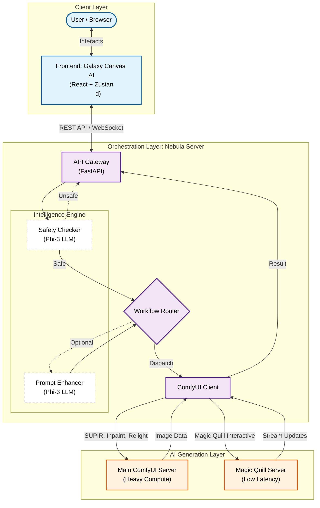

# Execution Overview & Pipeline Demonstration

This document outlines the complete execution pipeline of the Galaxy Canvas AI system, detailing the interaction between the Frontend, the Nebula Orchestration Server, and the specialized AI Backend Servers.

## System Architecture

The system follows a microservices-inspired architecture where a central orchestration server manages communication between the user interface and specialized AI processing nodes.



## Component Responsibilities

### 1. Frontend: Galaxy Canvas AI (React/Vite)
The frontend is the entry point for all user interactions. It handles:
-   **Canvas Management**: Multi-layer image editing, drawing tools, and crop/transform operations.
-   **State Management**: Uses `Zustand` (via `editorStore`) to manage image states, layers, and tool settings.
-   **User Input**: Captures prompts, brush strokes, and configuration parameters.
-   **API Communication**: Sends structured `WorkflowRequest` payloads to the Nebula Server.

### 2. Backend: Nebula Server (FastAPI)
The Nebula Server acts as the intelligent orchestrator and API gateway. It does not generate images itself but manages the process.
-   **Routing Logic**: Determines which AI server should handle a request based on the `workflow` type.
-   **Safety & Enhancement**:
    -   **Safety Check**: Uses a local LLM (Microsoft Phi-3) to analyze prompts for NSFW or harmful content before processing.
    -   **Prompt Improvement**: Optionally enhances user prompts to be more descriptive for better generation results.
-   **Protocol Translation**: Converts REST API requests from the frontend into WebSocket messages for ComfyUI.

### 3. AI Backend Servers (ComfyUI)
Two distinct ComfyUI instances are utilized to optimize performance and resource allocation.

#### A. Main ComfyUI Server (`BACKEND_URL_MAIN`)
Handles heavy, non-real-time computation tasks.
-   **Workflows Handled**:
    -   **SUPIR Upscale**: High-fidelity image upscaling.
    -   **Single Image Edit**: Inpainting, style transfer, and general image modifications.
    -   **Composition (Multi-Image)**: Blending multiple images or assets together.
    -   **Re-Lighting**: Adjusting the lighting of an image.

#### B. Magic Quill Server (`BACKEND_URL_MAGIC_QUILL`)
A dedicated server for high-interactivity tasks to ensure low latency.
-   **Workflows Handled**:
    -   **Magic Quill**: Real-time interactive painting/generation where the AI interprets brush strokes and prompts instantly.

## Optimization

### ComfyUI

- **Asynchronous Queue System**: Efficiently manages requests.
- **Smart Execution**: Only re-executes the parts of the workflow that changes between executions.
- **Smart Memory Management**: Can automatically run large models on GPUs with as low as 1GB VRAM with smart offloading.
- **CPU Support**: Works even if you don't have a GPU with: `--cpu` (slow).
- **Versatile Model Loading**: Can load ckpt and safetensors: All in one checkpoints or standalone diffusion models, VAEs and CLIP models.
- **Safe Loading**: Safe loading of ckpt, pt, pth, etc. files.
- **Advanced Features**: Support for Embeddings/Textual inversion.
- **Workflow Portability**: Saving/Loading workflows as JSON files.

### Magic Quill

- **Real-time Interactive Painting**: AI interprets brush strokes and prompts instantly.
- **Low Latency**: Dedicated optimization for high-speed feedback loops.
- **Precise Control**: Brush-based interface for localized AI-powered modifications.
- **Dynamic Masking**: Real-time mask generation combined with prompt-conditioned inpainting.

## Detailed Execution Pipeline

The following diagram illustrates the step-by-step flow of a request, taking a "Single Image Edit" as an example.

```mermaid
sequenceDiagram
    autonumber
    
    %% Dark Mode Optimized Colors
    box "Client Side" #333333
        participant User
        participant Frontend as Galaxy Canvas UI
    end
    
    box "Orchestration Layer" #1a237e
        participant Nebula as Nebula Server
        participant LLM as Local LLM / Safety
    end
    
    box "AI Generation Layer" #3e2723
        participant ComfyUI as ComfyUI Backend
    end

    User->>Frontend: Input Prompt & Image
    User->>Frontend: Click Generate
    Frontend->>Nebula: POST /api/workflow
    
    rect rgb(30, 40, 60)
        note right of Nebula: 1. Intelligence Phase
        Nebula->>LLM: Safety Check
        LLM-->>Nebula: Result: Safe
        
        opt Prompt Enhancement
            Nebula->>LLM: Improve Prompt
            LLM-->>Nebula: Enhanced Prompt
        end
    end

    rect rgb(30, 50, 40)
        note right of Nebula: 2. Execution Phase
        Nebula->>Nebula: Select Backend (Main/Magic)
        Nebula->>ComfyUI: Upload Assets & Queue Job
        
        loop Real-time Feedback
            ComfyUI-->>Nebula: WebSocket Progress
            Nebula-->>Frontend: Update Progress Bar
        end
        
        ComfyUI-->>Nebula: Generation Complete (Image)
    end

    Nebula-->>Frontend: Return Result Image
    Frontend->>User: Render on Canvas
```



## Workflow Routing Mechanism

The routing logic is implemented in `app/services/workflow_service.py`. The server inspects the `workflow` field in the request payload to decide the destination.

| Workflow ID | Target Backend | Description |
| :--- | :--- | :--- |
| `MAGIC_QUILL` | **Magic Quill Server** | Interactive, stroke-based generation. |
| `SUPIR_UPSCALE` | **Main Server** | High-quality upscaling using SUPIR model. |
| `SINGLE_EDIT` | **Main Server** | Standard image editing and inpainting. |
| `COMPOSITION` | **Main Server** | Multi-image composition and blending. |
| `RELIGHT` | **Main Server** | Image relighting tasks. |

## Frontend Integration Details

The frontend is designed to be agnostic of the complex backend routing. It simply sends a standardized request:

```typescript
// Example Request Structure
interface WorkflowRequest {
  workflow: "SINGLE_EDIT" | "MAGIC_QUILL" | "SUPIR_UPSCALE" | ...;
  inputs: {
    prompt: string;
    image?: string; // Base64
    mask?: string;  // Base64
    strength?: number;
    seed?: number;
  };
}
```

The `AIFeatureCard` component triggers these requests, and the `editorStore` updates the UI based on the response, adding the generated image as a new layer or updating the existing canvas.
