# NebulaEdit

**Adobe TechMeet Submission – AI Image Editing & Generation**

This repository contains our solution for the Adobe TechMeet challenge: a dual-component system delivering professional-grade AI image editing and generation tools on the web.

---

## Table of Contents

- [NebulaEdit](#nebulaedit)
  - [Table of Contents](#table-of-contents)
  - [Overview](#overview)
  - [Wireframes \& Design Rationale](#wireframes--design-rationale)
  - [Market Research](#market-research)
  - [Demo Video](#demo-video)
  - [Execution Overview](#execution-overview)
  - [Components](#components)
  - [Product Screenshots](#product-screenshots)
  - [Wireframes UI Screenshots](#wireframes-ui-screenshots)
  - [Setup Instructions](#setup-instructions)

---

## Overview
NebulaEdit is designed with a decoupled architecture: a fast, interactive frontend and a robust backend for heavy AI inference. The system hides the complexity of ComfyUI nodes behind a familiar, layer-based editing interface.

---

## Wireframes & Design Rationale
- [**View Wireframes**](./Wireframes-UI/)
- [**Design Rationale**](./Design-Rationale.pdf)

## Market Research
Our research highlights that most existing tools trade off control for simplicity. NebulaEdit targets creators who need precise, localized edits (e.g., relighting, element fusion) rather than generic image generation.
- [**Market Research Report**](./Market-Research.pdf)
- [**Demo Video: Market Research & Features**](./Demo.mp4)

## Demo Video
- [**Watch the Demo**](./Demo.mp4)

## Execution Overview
For a detailed look at the system architecture and execution pipeline, see:
- [**Execution Overview & Pipeline**](./Execution-overview.md)

---

## Components

- [**`galaxy-canvas-ai/`**](./galaxy-canvas-ai/): React + Vite frontend. Provides the canvas, toolbars, and interaction logic for features like MagicQuill and Image Fusion.
- [**`nebula-server/`**](./nebula-server/): Python/FastAPI backend. Bridges to ComfyUI, managing complex node workflows for AI features (Qwen-Image-Edit, Relighting, etc.).
- [**`setup.sh`**](./setup.sh): Deployment script for the server. Installs ComfyUI, Python venv, and fetches all required model weights from Hugging Face.

---

## Product Screenshots

Below are key screenshots demonstrating NebulaEdit's features and user interface:

| Screenshot | Description |
|------------|-------------|
| 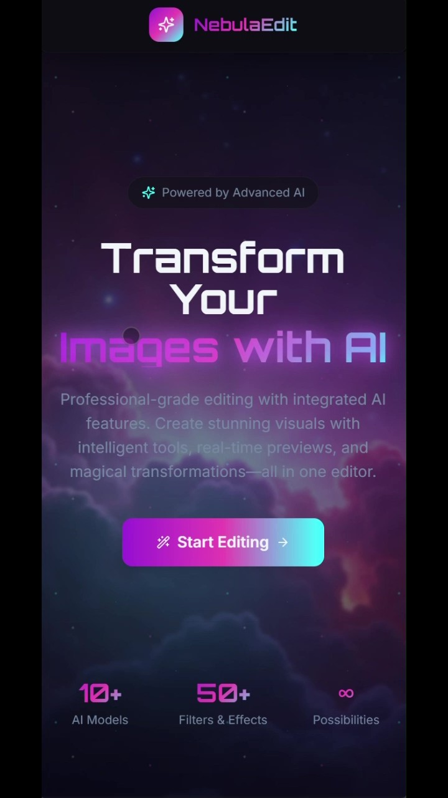 | Landing page introducing NebulaEdit and its capabilities. |
| 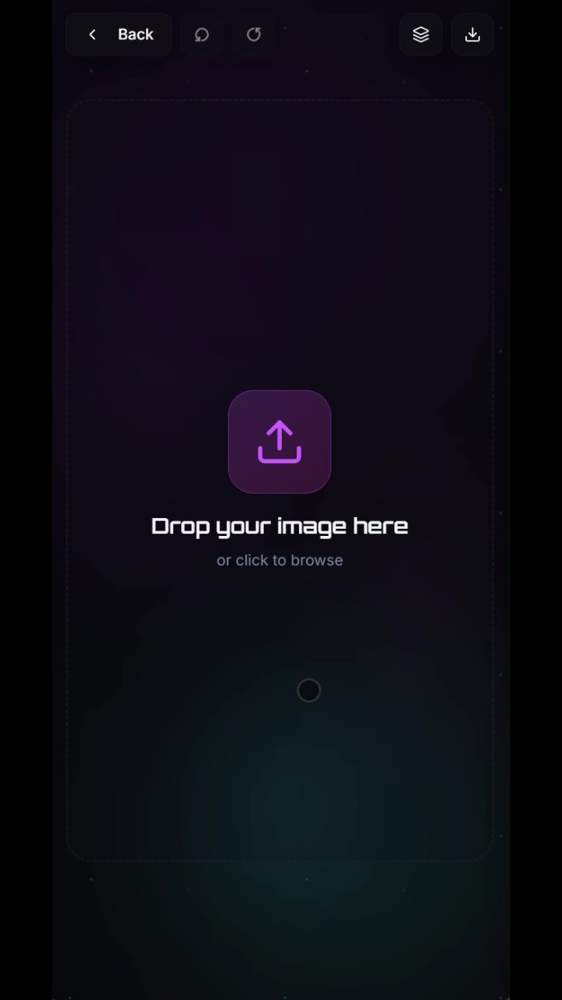 | Image upload screen where users can drag and drop or browse for images to edit. |
| 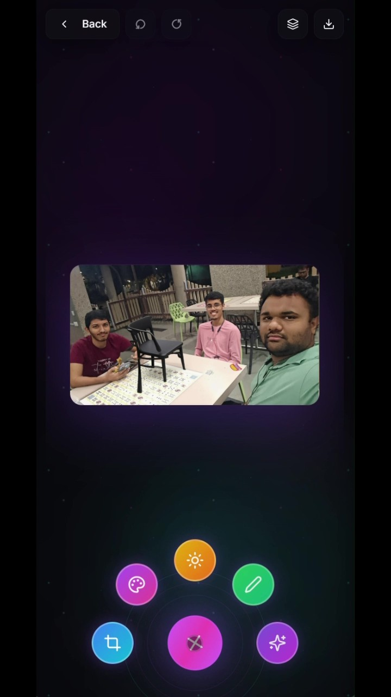 | Menu for selecting the type of AI-powered edit: AI Edit, Fusion, Relight, Upscale, or MagicQuill. |
| 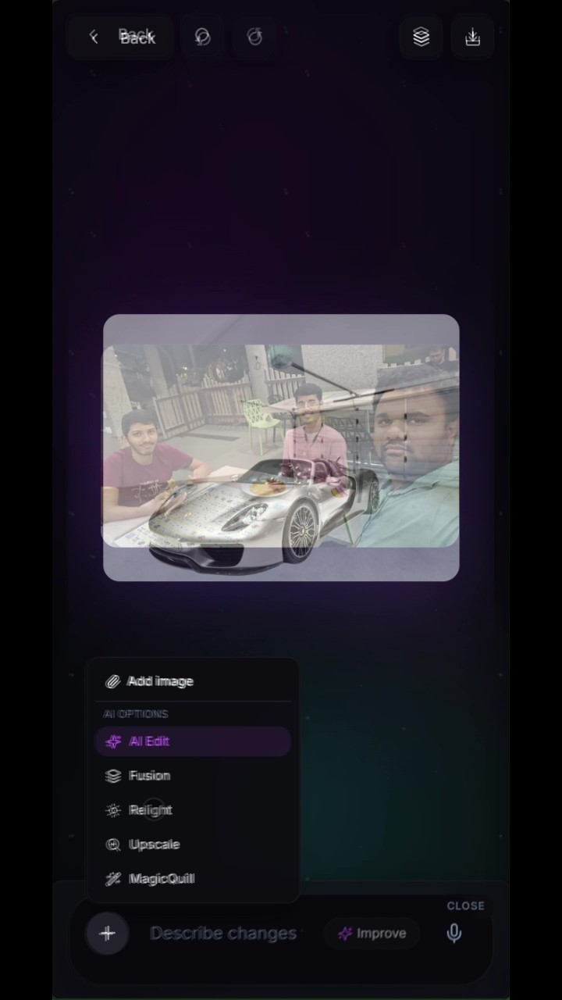 | The main editing interface showing available tools such as draw, erase, and text. |
| 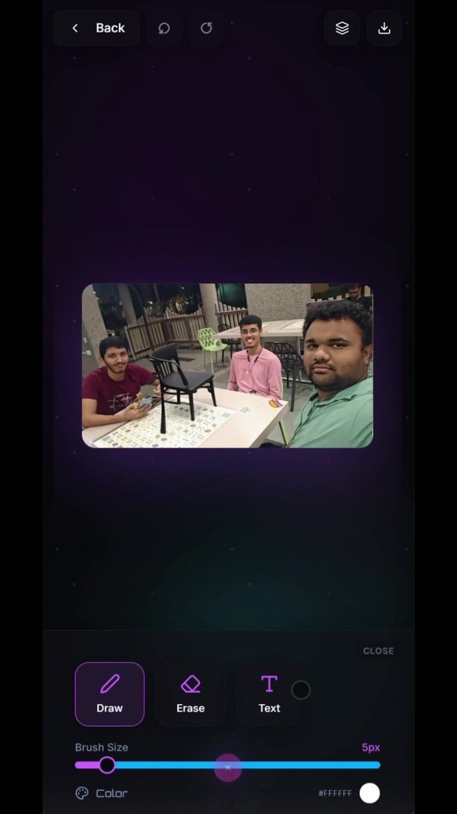 | Radial tool menu for quick access to core editing features. |
| 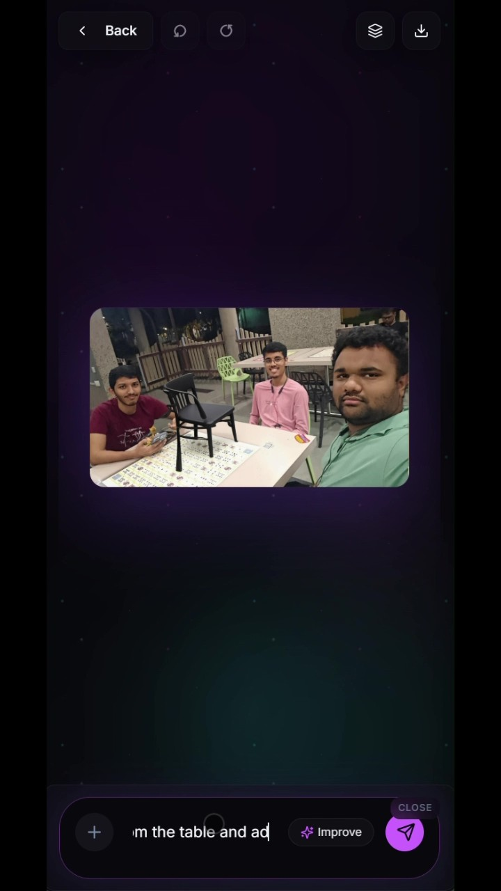 | Example of entering a prompt for AI-driven image editing. |
| 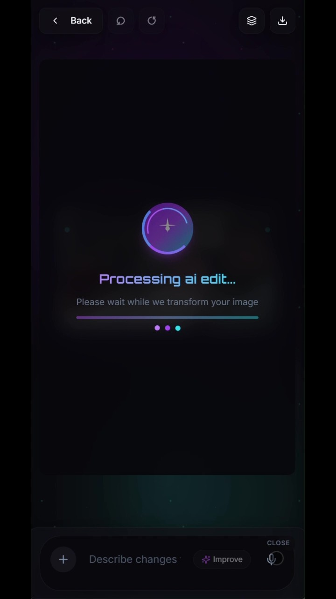 | Progress screen while the AI processes the requested edit. |
| 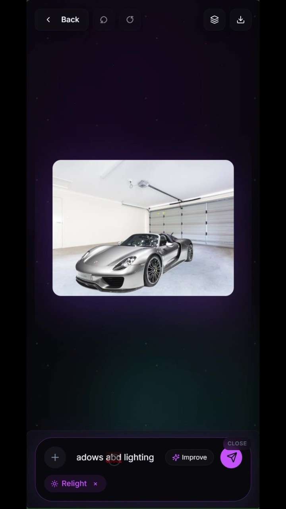 | Original image before applying the relighting feature. |
|  | Result after using the relight tool to adjust lighting and shadows. |
| 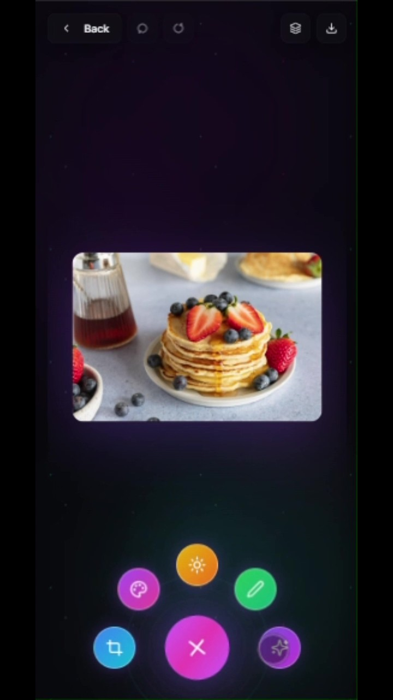 | Two images selected for the fusion feature. |
| 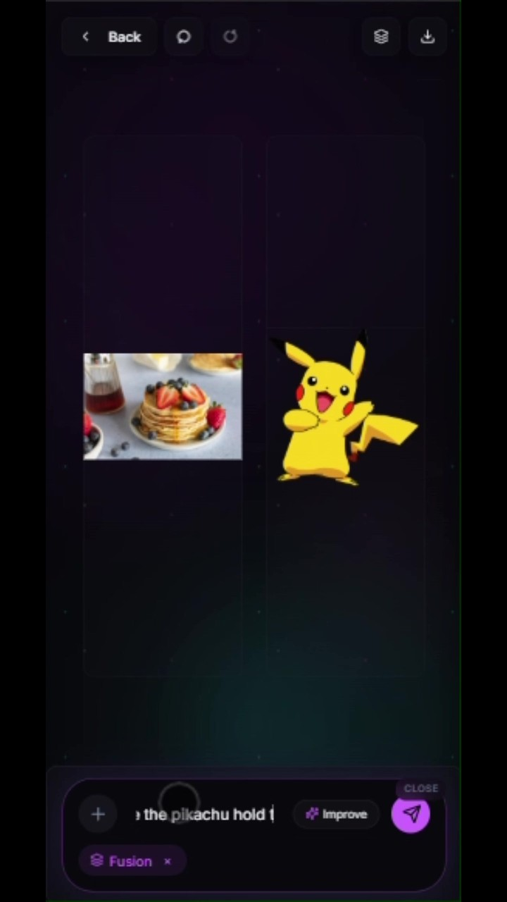 | Fusion in progress, combining elements from two images. |
| 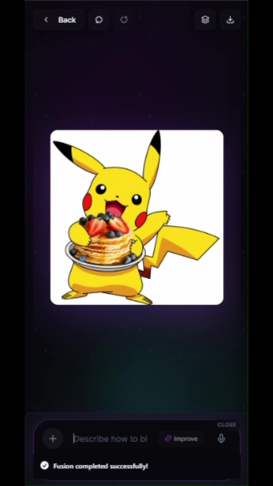 | Final result after successful image fusion. |
| 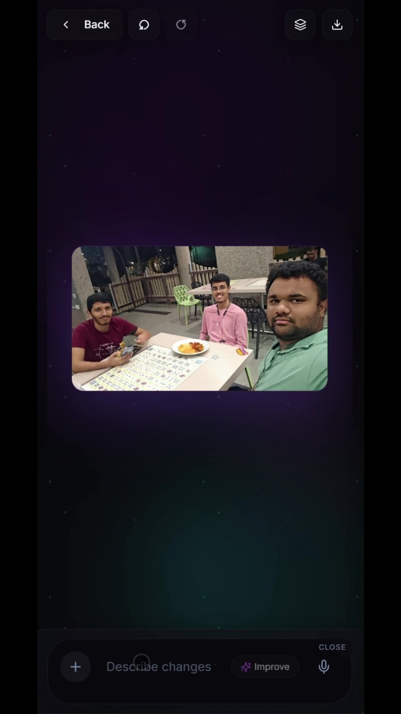 | Example of an image after various edits have been applied. |

These screenshots illustrate the workflow from uploading an image, choosing an edit type, entering prompts, and viewing the results of advanced AI-powered editing features.

---

## Wireframes UI Screenshots

The following images from the wireframes demonstrate the design and planned user experience of NebulaEdit:

| Screenshot | Description |
|------------|-------------|
|  | Themed background used throughout the application for a modern, immersive look. |
|  | The main editor canvas where users interact with their images and apply edits. |
|  | Adjustment panel for fine-tuning image properties such as brightness, contrast, and more. |
|  | Filters panel showcasing a variety of effects that can be applied to images. |

These wireframe screenshots provide insight into the application's design philosophy and user-centric interface planning.

---

## Setup Instructions
See [setup_instructions.md](./setup_instructions.md) for detailed setup and deployment steps.

